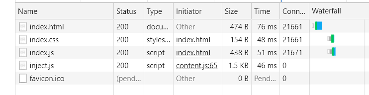
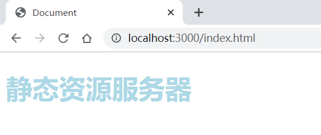

# 静态资源服务器练习
>使用url模块解析路径
```js
const url=require('url')
const main=(req,res)=>{
    // 将访问路径解析成对象
    const url=url.parse(req.url)
    res.end(url)
}
```
>使用path获取本地路径的文件
```js
const path=require('path')
const root=__dirname
const main=(req,res)=>{
    // file为index.html在的目录
    const file=path.join(root,'index.html')
    res.end()
}
```
>使用stream读取响应文件
```js
// 创建fs.ReadStream
const stream = fs.createReadStream(path)
stream.on('data',chunk=>{
    res.write(chunk)
})
stream.on('end',()=>{
    res.end()
})
/**
 *  上面代码可以使用stream的管道 替代 
 *  内部会自动关闭响应
 *  req也可以接pipe
*/
stream.pipe(res)
```
>检查文件是否存在
```js
fs.stat(path,(err,stat)=>{
    if(err.code=='ENOENT'){
        // 文件不存在 的操作
    }else{
        // 文件存在 执行的操作 ;typeof stat==object
    }
})
```

# 运行
```shell
# 进入根目录安装依赖
npm i
# 进入该项目目录运行项目
node index.js
# 打开浏览器输入 http://localhost:3000/index.html
```
# 效果


