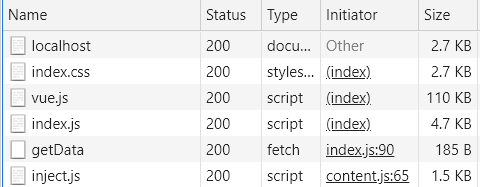

# 使用connect自带中间件
- 注意:自带中间件已经抽离，需要单独安装使用
- 使用自带的静态服务中间件[serve-static](https://www.npmjs.com/package/serve-static)替换todo中手写的静态服务
- 使用[body-parser](https://www.npmjs.com/package/body-parser)来解析前端传递的值
- 使用compression对响应进行压缩,如下图对比

>压缩

> 未压缩

## 关于压缩
通过Content-Encoding来对特定媒体类型的数据进行压缩,当这个首部出现的时候，它的值表示消息主体进行了何种方式的内容编码转换。[MDN](https://developer.mozilla.org/zh-CN/docs/Web/HTTP/Headers/Content-Encoding)
>客户端
- 请求时携带Accept-Encoding: gzip, deflate告知服务端使用什么压缩模式
>服务端
- 响应Content-Encoding: gzip，提供压缩模式

# 支持的中间件
- 
- 详情[官方仓库](https://github.com/senchalabs/connect)
