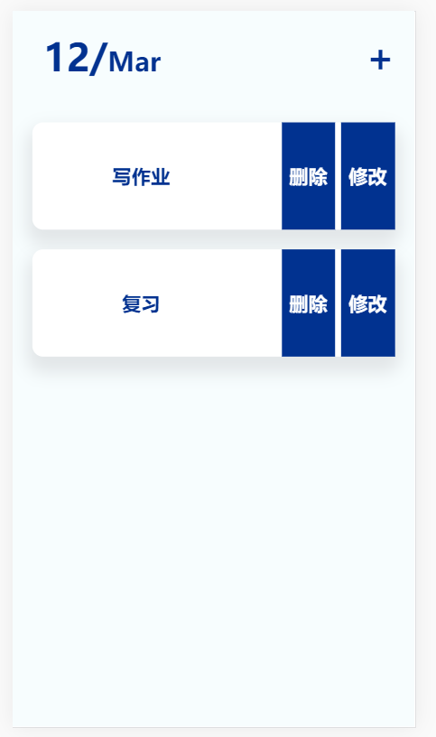
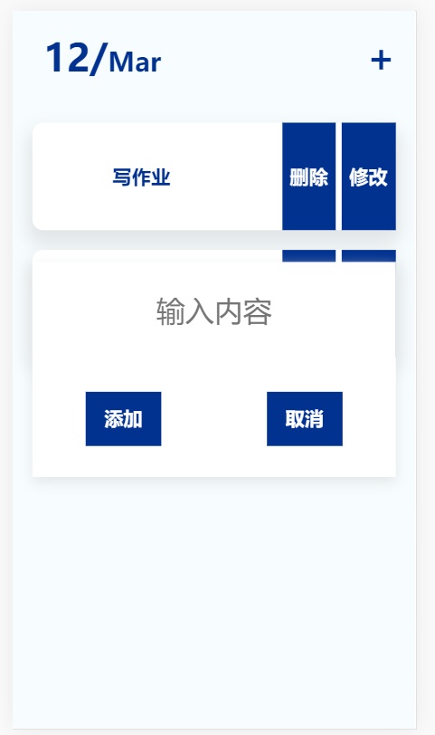

# todo
没有数据库参与的一个todo的前后端分离的demo

# 项目功能说明
- 增加项目
- 删除项目
- 修改存在的项目
- 显示今天日期

# 目录说明
- css+js+html为前端部分
- until下的文件是负责静态资源文件处理的
- route下的是数据接口
- indes.js入口文件
- img存放的前端效果图

# 运行
```shell
# 进入根目录安装依赖
npm i
# 进入该项目目录运行项目
node index.js
# 打开浏览器输入 http://localhost:3000/index.html
```
# 界面
> 主界面
- 
>添加项目
- 
>没有项目的界面
- 


